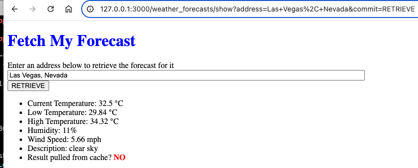
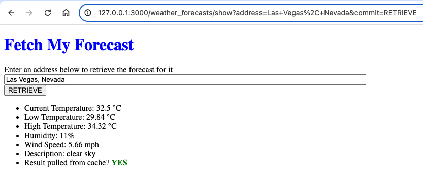

# Weather forecaster app using Ruby on Rails

## Scope

1. Use Ruby On Rails.
2. Accept an address as input.
3. Retrieve forecast data for the given address. This should include, at minimum, the current temperature. Bonus points: retrieve high/low and/or extended forecast.
4. Display the requested forecast details to the user.
5. Cache the forecast details for 30 minutes for all subsequent requests by zip codes. Display indicator in the result if it is pulled from cache.

## Set up Rails

### Install Brew package manager

[HomeBrew](https://brew.sh/) is a commonly used package manager on macOS. Follow steps on their homepage to install.

### Install Ruby

I like to install `ruby` using the latest version via `brew`.

The command below should install latest Ruby version.

```sh
% brew install ruby
```

### Install Rails

Install Ruby on Rails gem:

```sh
% gem install rails
% bundle
```

### Install Google Chrome

Install Google Chrome for Ruby on Rails system tests:

```sh
% brew install google-chrome
```

### Setup PostgreSQL

Using brew run the command below to install Postgres 14
```sh
% brew install postgresql@14
```

Create a forecaster user and grant Superuser and Create DB permissions
```sh
% createuser forecaster
% psql -d postgres
% alter user forecaster WITH SUPERUSER;
% alter user forecaster WITH CREATEDB;
```

Create devlopment and test databases using the commands below
```sh
createdb -O forecaster weather_forecasts_development
createdb -O forecaster weather_forecasts_test
```

## Set up the app

### Create a new app

Create a new Ruby on Rails app using PostgreSQL and test it:

```sh
% rails new fetch-weather-forecast --database=postgresql
% cd fetch-weather-forecast
% bin/rails test
% bin/rails test:system
% bin/rails server
% curl http://127.0.0.1:3000
% lsof -ti:3000 | xargs kill -9
```

## Code Editor

Most modern software development is done using a code editor like [Visual Studio Code](https://code.visualstudio.com/)

To get started check out the VsCode [DOCS](https://code.visualstudio.com/docs)

## Rubygems

### The following gems were installed for this coding assessment
- [faker](https://rubygems.org/gems/faker) : used to easily generate fake data names, addresses, numbers, etc.
- [rubocop](https://rubygems.org/gems/rubocop) : Ruby code style checking and code formatting tool
- [rubocop-rails](https://rubygems.org/gems/rubocop-rails) : RuboCop extension focused on enforcing Rails best practices and coding conventions
- [geocoder](https://rubygems.org/gems/geocoder) : Object geocoding, reverse geocoding, distance queries for ActiveRecord and Mongoid, result caching, and more.
- [faraday](https://rubygems.org/gems/faraday) : HTTP/REST API client library.
- [faraday_middleware](https://rubygems.org/gems/faraday_middleware) : Various middleware for Faraday

## Accept an address as input

Create a controller that can accept an address as an input parameter. One method to test this is by saving the address in the session.

### Generate weather forecasts controller and associated test

```sh
% bin/rails generate controller weather_forecasts show
```

Please see controller test in `test/controllers/forecasts_controller_test.rb`:

Generate a system test that will launch the web page and test show page contains correct header.

```sh
% bin/rails generate system_test forecasts
```

Please see system test in `test/system/forecasts_test.rb`:

Run tests:

```sh
% bin/rails test:all
```

## Get forecast data for the given address

There are a variety of ways to get forecast data. I choose the approach below.

* First I convert an address to a latitude and longitude by using the geocoder gem and the [GEOAPIFY API](https://www.geoapify.com/)

* Next I send the latitude and longitude to the [OPENWEATHERMAP API](https://openweathermap.com)

* To enable making calls to the Geoapify API I created an API KEY and used Rails credentials for my development environment following the steps outlined [HERE](https://railsnotes.xyz/blog/custom-credentials-in-your-rails-app#adding-credentials-via-the-terminal)

```sh
EDITOR="code --wait"  bin/rails credentials:edit --environment development
```

VsCode should open a *.development.yml file add your api keys and save file
```ruby
geoapify:
  api_key: <API KEY>

openweather:
  api_key: <API KEY>
```

Create a `/config/initializers/geocoder.rb` file with the contents below

```ruby
Geocoder.configure(
  lookup: :geoapify,
  api_key: Rails.application.credentials.dig(:geoapify, :api_key)
)
```

* To implement the Openweathermap API as an application service I created `app/services/weather_service.rb` to use Faraday to make a GET request to openweathermap URL and parse the response to define the current temp, low temp (min), high temp (max) plus the humidity, wind speed and description.

## Display the requested forecast details to the user

### Weather forecasts controller

See `app/controllers/forecasts_controller` for implementation details

### Weather forecasts view

See `app/views/forecasts/show.html.erb` for implementation details

## Cache weather forecast details with visual indicator

To enable the Rails development cache such that a developer can see that the forecasts are cached as expected I ran the command below.

```sh
bin/rails dev:cache
```

## Start server locally and test caching

```sh
rails s
```

In your web browser go to `http://127.0.0.1:3000`

Test Case 1: Enter an address of your choosing and click `RETRIEVE`

You should see output similar to below:


Test Case 2: Click `RETRIEVE` again for the same address (within 30 minutes)

You should see output similar to below:
